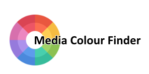

# Our.Community.MediaColourFinder

TODO: describe your package

<!--
Including screenshots is a really good idea! 

If you put images into /docs/screenshots, then you would reference them in this readme as, for example:

-->

## Installation

Add the package to an existing Umbraco website (v10.4+) from nuget:

`dotnet add package Umbraco.Community.Our.Community.MediaColourFinder`

TODO *provide any other instructions for someone using your package*

## Contributing

Contributions to this package are most welcome! Please read the [Contributing Guidelines](CONTRIBUTING.md).

## Acknowledgments

<a href="https://www.flaticon.com/free-icons/color" title="color icons">Color icons created by Nikita Golubev - Flaticon</a>
